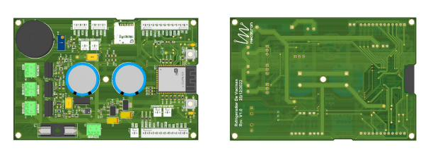
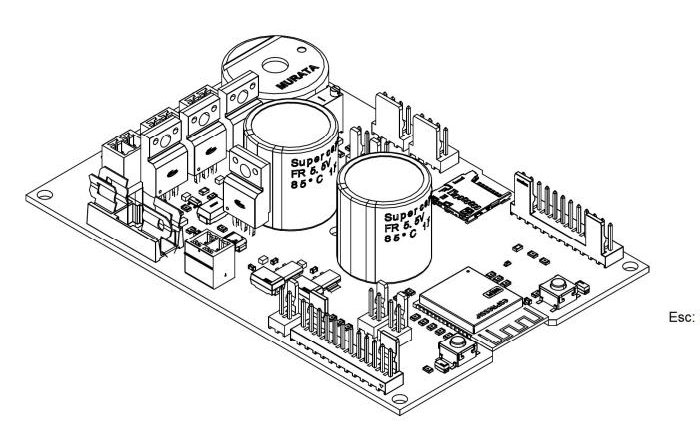

# MecaVac

*Refrigerador inteligente para vacinas — controle de temperatura, monitoramento de porta e log de eventos em ESP32.*

**Mecatron Projetos e Consultoria Jr.** · Hardware (Altium Designer) + Firmware (ESP32 / PlatformIO) · 2022 · Projeto concluído e aprovado pelo cliente; descontinuado após a primeira versão.

Este repositório reúne o firmware, o projeto de hardware e a documentação técnica do MecaVac — internamente registrado na Mecatron como *Refrigerador de Vacinas* (projeto nº 0000034). Ele também guarda o histórico real de desenvolvimento: sketches de bancada, versões intermediárias do firmware e o início (incompleto) de uma segunda revisão, mantidos aqui como registro de como o projeto evoluiu, não como parte do build final.


gora
## Sumário

- [Sobre o projeto](#sobre-o-projeto)
- [Minha atuação](#minha-atuação)
- [Como funciona](#como-funciona)
- [Funcionalidades](#funcionalidades)
- [Hardware](#hardware)
- [Firmware](#firmware)
- [Estrutura do repositório](#estrutura-do-repositório)
- [Compilando e gravando o firmware](#compilando-e-gravando-o-firmware)
- [Lições aprendidas e limitações conhecidas](#lições-aprendidas-e-limitações-conhecidas)
- [Tecnologias utilizadas](#tecnologias-utilizadas)
- [Status do projeto](#status-do-projeto)
- [Licença e uso](#licença-e-uso)
- [Autor](#autor)

## Sobre o projeto

O MecaVac é um refrigerador para armazenamento de vacinas, desenvolvido sob demanda de um cliente que precisava de um equipamento com controle de temperatura confiável e rastreabilidade do que acontece dentro dele: quando a porta é aberta, quando uma vacina é retirada, e o que acontece em caso de queda de energia.

O equipamento final integra:

- placa de circuito impresso customizada, com ESP32 como controlador central;
- acionamento de dois módulos Peltier (TEC) para refrigeração, controlados por PWM;
- sensoriamento de porta, temperatura, retirada de vacina e falha dos módulos Peltier;
- display LCD local para status e configuração de data/hora;
- log de eventos em cartão microSD, com backup de energia via supercapacitores;
- provisionamento de Wi-Fi via portal cativo, para envio de status e logs a um servidor do cliente.

O projeto passou por testes de bancada e de campo, foi validado e aprovado pelo cliente. Depois da entrega, ficou claro que a primeira versão tinha vários pontos a melhorar (ver [Lições aprendidas](#lições-aprendidas-e-limitações-conhecidas)) — mas o custo de uma segunda revisão de hardware não se pagou para o cliente, e o projeto foi encerrado nessa primeira versão.

## Minha atuação

Entrei na Mecatron Jr. ainda no primeiro ano da faculdade, como Assessor de Projetos, e o MecaVac acabou ficando comigo do início ao fim: concepção, hardware, firmware, documentação e as reuniões — tanto internas quanto com o cliente que pagou pelo desenvolvimento. Como em qualquer empresa júnior brasileira, a atuação foi voluntária (empresas juniores não podem remunerar seus membros), mas foi a experiência mais próxima de um projeto real que tive até então: cliente pagante, prazo e responsabilidade técnica de ponta a ponta.

Principais responsabilidades:

- projeto completo da PCB no Altium Designer — esquemático, seleção de componentes, roteamento e liberação para fabricação;
- desenvolvimento do firmware em C/C++ (ESP32, PlatformIO);
- definição da arquitetura de log local (SD) e de comunicação com o servidor do cliente;
- documentação técnica do hardware e do firmware;
- interlocução direta com o cliente e com a diretoria da empresa júnior.

Aprovação técnica do projeto (Mecatron Jr.): Nisio José S. Neto.

## Como funciona

Em operação normal, o ESP32 lê periodicamente os três sensores de temperatura (DS18B20, barramento OneWire) e calcula a média entre as duas sondas do compartimento de vacinas. Essa média é comparada a uma temperatura ideal (6 °C) e o firmware ajusta a potência aplicada aos dois módulos Peltier em quatro patamares (0%, ~27%, ~50% e 100% de duty cycle), de acordo com o quanto a leitura está fora da faixa aceitável.

Um sensor magnético detecta a abertura da porta: ao abrir, a luz interna acende e o LED de status muda de verde para vermelho; se a porta ficar aberta além de um tempo configurável (10 segundos na versão final), o buzzer soa até que a porta seja fechada ou um dos botões externos seja pressionado. Cada módulo Peltier tem um sensor próprio de funcionamento, permitindo detectar falha em um dos dois de forma independente.

Um relógio de tempo real (DS1307) mantém data e hora mesmo sem conexão, usadas tanto na exibição do display quanto na marcação dos eventos gravados no cartão microSD. Se a alimentação principal cai, um sensor de queda de energia dispara e o firmware grava esse evento no SD — o equipamento continua ligado por alguns segundos graças a dois supercapacitores de 1F carregados por um circuito de soft-start, tempo suficiente para o log ser gravado com segurança antes do desligamento total.

Na primeira inicialização (ou após um reset de configurações), o dispositivo sobe uma rede Wi-Fi temporária para que alguém conecte um celular ou notebook e configure a rede definitiva com internet; a partir daí, o equipamento reporta status e histórico de eventos ao servidor do cliente. Enquanto não há conexão configurada, ou se ela cai, os logs continuam sendo salvos localmente no SD.

O display LCD 20x4 alterna entre diferentes telas de status (inicializando, temperatura + hora, porta aberta, conectado/não conectado à internet) e tem um modo de configuração de data/hora, acessado segurando os dois botões físicos por alguns segundos.

## Funcionalidades

- Controle de temperatura por PWM em dois módulos Peltier, com lógica por patamares a partir da média de dois sensores DS18B20 (terceiro sensor mantido como referência independente).
- Sensor dedicado de funcionamento em cada módulo Peltier, para detecção de falha.
- Monitoramento de porta (sensor magnético) com acionamento automático de luz interna e alarme sonoro após tempo configurável.
- Indicação visual de status via LED RGB.
- Display LCD 20x4 (I2C) com múltiplas telas de status e modo de configuração de data/hora.
- RTC (DS1307) para marcação temporal dos eventos.
- Log de eventos (porta, temperatura, quedas de energia) em cartão microSD, como redundância local independente da internet.
- Detecção de queda de energia com backup local (dois supercapacitores de 1F + circuito de soft-start), garantindo tempo para gravar o evento antes do desligamento.
- Provisionamento de rede Wi-Fi via portal cativo (sem credenciais fixas no firmware), com envio de status e logs a um servidor remoto do cliente.
- Leitura de retirada de vacinas por meio de uma rede de microswitches decodificada em uma única entrada analógica (ver detalhe em [Lições aprendidas](#lições-aprendidas-e-limitações-conhecidas)).

## Hardware

A PCB foi projetada por mim no Altium Designer — meu primeiro projeto de placa desse porte, com processador, múltiplos subsistemas de sensoriamento, drivers de potência e gerenciamento de energia integrados em uma placa só.

### Especificações da PCB

| Item | Especificação |
|---|---|
| Controlador | ESP32-WROOM-32D |
| Camadas | 2 (top/bottom), cobre 0,30 mm por camada |
| Substrato | FR-4, dielétrico 0,96 mm |
| Espessura total | 1,60 mm |
| Dimensões (placa) | ~76 × 71 mm |
| Encaixe mecânico | ~120 × 80 mm |
| Furos | 143 (50 vias de 0,30 mm + furos de montagem/componentes em diversos diâmetros) |
| Alimentação | Entrada 12 V, com reguladores lineares para 5 V e 3,3 V |
| Proteção de entrada | Diodo TVS 15 V |
| Backup de energia | 2× supercapacitor 1F / 5,5 V com circuito de soft-start |

### Destaques de projeto

- **Recorte sob a antena do ESP32-WROOM-32D**: a área de cobre logo abaixo da antena integrada do módulo foi removida do plano de referência, seguindo a recomendação do fabricante, para reduzir a interferência no sinal Wi-Fi.
- **Drivers de potência** para os dois módulos Peltier e para a lâmpada interna, com MOSFETs de canal N (IRF1404PBF) acionados por um par de transistores BC846/BC807 fazendo o drive de gate.
- **Backup de energia** com dois supercapacitores de 1F / 5,5 V e circuito de soft-start (limitação de inrush no carregamento), dedicado a manter o sistema vivo por alguns segundos após uma queda de energia — tempo suficiente para gravar o evento no cartão SD.
- **Leitura de retirada de vacina por escada resistiva**: em vez de uma entrada digital por compartimento, o hardware usa uma rede de microswitches com resistores em escada, lida por uma única entrada analógica — cada combinação de chaves fechadas gera um nível de tensão distinto, decodificado em firmware para identificar qual compartimento (até 15) teve uma vacina retirada.



### Principais componentes

| Componente | Função |
|---|---|
| ESP32-WROOM-32D | Microcontrolador principal |
| LM1117IMP-3.3 / LM1117MPX-5.0 | Reguladores lineares 3,3 V e 5 V |
| IRF1404PBF (×4) | MOSFETs de potência — Peltier 1, Peltier 2, lâmpada e soft-start |
| BC846BLT1G / BC807-40-7-F | Transistores de drive de gate |
| Supercapacitor 1F / 5,5 V (×2) | Backup de energia |
| DS1307 | RTC (relógio de tempo real, módulo externo à PCB) |
| DS18B20 (×3) | Sensores de temperatura (OneWire) |
| PKB24SPCH3601-B0 | Buzzer piezoelétrico (alarme) |
| TVS-15V | Proteção contra transientes na entrada de 12 V |

A lista completa de materiais (BOM) e as folhas de fabricação (camadas, drill table, indicação de conectores) estão na documentação técnica exportada em `Documentação/`.

### Mapeamento de pinos (ESP32)

| Pino | Função | Referência na PCB |
|---|---|---|
| EN | Reset da CPU | RST |
| IO00 | Habilita gravação de firmware | BOOT |
| IO02 | Cartão microSD — CS/SS | – |
| IO04 | Controle PWM dos módulos Peltier | – |
| IO05 | LED RGB — canal azul | LED B |
| IO12 | Sensor de funcionamento — Peltier 1 | – |
| IO13 | Sensor de funcionamento — Peltier 2 | – |
| IO14 | Sensor magnético — porta 1 | MAG1 |
| IO15 | Sensor magnético — porta 2 | MAG2 |
| IO16 | LED RGB — canal vermelho | LED R |
| IO17 | LED RGB — canal verde | LED G |
| IO18 | Cartão microSD — CLK | – |
| IO19 | Cartão microSD — MISO | – |
| IO21 | I2C — SDA (display / RTC) | SDA |
| IO22 | I2C — SCL (display / RTC) | SCL |
| IO23 | Cartão microSD — MOSI | – |
| IO25 | Lâmpada interna (12 V) | LAMP |
| IO26 | Barramento OneWire — 3× DS18B20 | TERM |
| IO27 | Botão externo 1 (navegação display) | B1 |
| IO32 | Botão externo 2 (navegação display) | B2 |
| IO33 | Buzzer (alarme sonoro) | – |
| IO34 | Rede de microswitches — retirada de vacina | RET |
| IO35 | Sensor de queda de energia | – |

### Conectores externos

| Conector / lado | Sinais |
|---|---|
| Botões do monitor 1 e 2 | +3,3 V, B1 / B2 |
| Display LCD | +5 V, SCL, SDA, GND |
| RTC (módulo externo) | +3,3 V, SCL, SDA, GND |
| Sensor magnético — porta 1 e 2 | +3,3 V, MAG1 / MAG2 |
| Sensores de temperatura (3×, em paralelo) | +3,3 V, TERM, GND |
| Sensor de retirada de vacina | +3,3 V, VAC, GND |
| Peltier 1 / Peltier 2 | +12 V, GND |
| Lâmpada interna | +12 V, GND |
| LED RGB | LED R, LED G, LED B, GND |
| Coolers 1, 2 e 3 (dissipação térmica) | +12 V, GND |
| Entrada de energia | +12 V, GND |

O pinout completo dos conectores (P1–P11, J1, J2) está na documentação técnica exportada em `documentação/`.

## Firmware

O firmware roda sobre o **framework Arduino para ESP32**, gerenciado via **PlatformIO** (`Firmware/platformio.ini`, ambiente `esp32dev`).

### Bibliotecas utilizadas

- `Wire` — comunicação I2C (display e RTC)
- `LiquidCrystal_I2C` — display LCD 20x4
- `OneWire` + `DallasTemperature` — sensores de temperatura DS18B20
- `SD`, `SPI`, `FS` — cartão microSD
- `WiFi`, `DNSServer`, `ESPAsyncWebServer`, `ESPAsyncWiFiManager` — provisionamento de rede e portal cativo
- API nativa do ESP32 (`ledcSetup` / `ledcAttachPin` / `ledcWrite`) — PWM dos módulos Peltier

### Arquitetura

O `loop()` principal é organizado em blocos sequenciais e não bloqueantes (baseados em `millis()`, sem `delay()` na lógica crítica): leitura e debounce de portas e botões, controle de luz e alarme, leitura da rede de microswitches de retirada de vacina, controle de temperatura/PWM dos Peltiers, monitoramento de queda de energia, leitura do RTC, máquina de estados do display (telas de status + modo de configuração) e o provisionamento de Wi-Fi.

A comunicação com o servidor do cliente foi desenhada em torno de códigos de evento (por exemplo: boot, abertura/fechamento de porta, retirada de vacina, queda de energia) — visíveis nos comentários `// SERVIDOR: ...` espalhados pelo código, que documentam o protocolo pensado para o envio de dados.

### Histórico de desenvolvimento (`Firmware/src/`)

O firmware evoluiu por meio de sketches de bancada, testando cada subsistema isoladamente antes da integração final. Esses arquivos foram mantidos no repositório como histórico real do desenvolvimento — não como parte do build final.

| Arquivo | O que é |
|---|---|
| `main.cpp` | **Firmware final**, integrado e entregue ao cliente. |
| `testes.cpp` | Evolução mais avançada do firmware principal: adiciona suporte experimental a uma segunda porta e um log mais estruturado no SD. Ficou incompleto (há erros de sintaxe) quando o projeto foi descontinuado. |
| `test_arduino.cpp` | Snapshot intermediário do firmware principal, ainda com a pinagem de uma revisão anterior da placa. |
| `teste_buzzer.cpp` | Bring-up consolidado de porta, luz interna, LED RGB e buzzer, anterior à integração de display e RTC. |
| `paginação_dispcomp.cpp` | Rascunho inicial da máquina de estados do display — mais ambicioso que a versão final (previa seleção de idioma, unidade °C/°F, beep de navegação e lembrete de troca de filtro, cortados do escopo final). |
| `base_display.cpp` | Teste de inicialização do LCD 20x4 via I2C. |
| `teste_RTC.cpp` | Teste de leitura/escrita do RTC DS1307. |
| `endereços_sens_temp.cpp` | Varredura do barramento OneWire para descobrir os endereços únicos de cada DS18B20. |
| `leit_sens_temp.cpp` | Teste de leitura simultânea das 3 sondas de temperatura. |
| `teste_peltier.cpp` | Bancada de calibração do driver de Peltier (ajuste manual de duty cycle via serial, com leitura em display OLED). |
| `teste_peltier2.cpp` | Teste simples de PWM (fade) no canal do MOSFET do Peltier. |
| `config_saidavac.cpp` | Calibração experimental dos limiares de tensão da rede de microswitches de retirada de vacina. |
| `aperto_botão.cpp` | Estudo de debounce de botão. |
| `base_SD.cpp` | Utilitários de cartão SD (listar, ler, escrever, renomear, apagar). |
| `conect_wifi.cpp` | Teste isolado do provisionamento Wi-Fi via portal cativo (AsyncWiFiManager). |
| `serv_web.cpp` | Protótipo de referência (baseado em tutorial externo, ver comentário no arquivo) para servidor web embarcado — não integrado à versão final. |

> Como cada um desses arquivos tem sua própria função `setup()`/`loop()`, eles **não compilam juntos**. Para montar apenas o firmware final, veja [Compilando e gravando o firmware](#compilando-e-gravando-o-firmware).

## Estrutura do repositório

```
MecaVac/
├── Firmware/                     # Projeto PlatformIO (ESP32, framework Arduino)
│   ├── src/
│   │   ├── main.cpp                # Firmware final
│   │   └── ...                     # Sketches de bring-up (ver tabela acima)
│   ├── lib/
│   ├── include/
│   ├── test/
│   └── platformio.ini
├── Hardware/                     # Projeto Altium Designer
│   ├── MecaVac.PrjPcb
│   ├── MecaVac.SchDoc
│   ├── MecaVac.PcbDoc
│   └── v2 (descontinuada)/         # Início não finalizado de uma segunda revisão
├── Documentação/
│   ├── imagens/                     # Imagens usadas neste README
│   └── Documentação_Refrigerador_de_Vacinas.pdf   # Exportação técnica (dimensões, BOM, pinout, camadas)
└── README.md
```

> A pasta `Hardware/` é mantida principalmente como backup do projeto Altium. Ajuste os nomes e caminhos acima conforme a organização real da sua cópia local — alguns arquivos da segunda revisão (nunca finalizada) podem estar incompletos ou ausentes.

## Compilando e gravando o firmware

Pré-requisitos: [PlatformIO](https://platformio.org/) (CLI ou extensão do VSCode) e uma placa ESP32 DevKit.

1. Clone o repositório.
2. Dentro de `Firmware/src/`, mantenha apenas `main.cpp` (mova os demais arquivos de teste para fora da pasta `src/`, já que todos possuem `setup()`/`loop()` próprios e são compilados juntos por padrão pelo PlatformIO).
3. Confirme os endereços dos sensores DS18B20 (`Probe01`, `Probe02`, `Probe03`) em `main.cpp` — use `endereços_sens_temp.cpp` para descobrir os endereços do seu hardware, caso sejam diferentes.
4. Compile e grave:

   ```bash
   cd Firmware
   pio run --target upload
   ```

5. Acompanhe os logs pela serial:

   ```bash
   pio device monitor -b 115200
   ```

## Lições aprendidas e limitações conhecidas

Esta foi minha primeira PCB de porte relevante, e a experiência deixou aprendizados concretos — alguns só ficaram claros depois dos testes de campo:

- **Driver de potência superdimensionado.** Um professor de eletrônica avaliou o driver dos Peltiers/lâmpada (MOSFET + par de transistores BC846/BC807 para acionamento de gate) e apontou que o mesmo resultado seria possível com bem menos componentes. Foi um dos principais pontos mapeados para revisão em uma eventual segunda versão.
- **Conflito de pino entre a leitura de retirada de vacina e o PWM do Peltier.** Na integração final, o pino usado para decodificar a rede de microswitches de retirada de vacina (`leitura`, GPIO4) ficou mapeado para o mesmo pino da saída PWM dos módulos Peltier (`peltier`, GPIO4) — por isso essa leitura ficou comentada em `main.cpp`, funcionando apenas nos sketches de bancada (`config_saidavac.cpp` e versões anteriores do firmware).
- **Comunicação com o servidor documentada, mas não totalmente implementada no firmware.** O protocolo de códigos de evento para o servidor do cliente foi definido (comentários `// SERVIDOR: ...` no código), mas parte do envio ainda estava em desenvolvimento quando o projeto foi encerrado.
- **Segunda versão não viabilizada.** Os pontos acima, entre outros menores, motivaram o início de uma segunda revisão de hardware — mas o custo adicional não se justificou para o cliente depois da primeira entrega, e o projeto foi formalmente encerrado na v1, mesmo aprovado e funcional.

## Tecnologias utilizadas

`Altium Designer` · `ESP32` · `C/C++ (Arduino Framework)` · `PlatformIO` · `I2C` · `OneWire` · `SPI` · `Wi-Fi (WiFiManager / ESPAsyncWebServer)` · `RTC DS1307` · `DS18B20` · `Gerenciamento de energia (supercapacitores)` · `Git`

## Status do projeto

Concluído, testado e **aprovado pelo cliente** em 2022. Descontinuado logo após a entrega, sem uma segunda versão programada. Este repositório é mantido como referência técnica e de portfólio pessoal.

## Licença e uso

Este projeto foi desenvolvido sob demanda para um cliente da Mecatron Projetos e Consultoria Jr., que é o proprietário do produto final. O conteúdo deste repositório é disponibilizado publicamente como portfólio técnico pessoal e registro de desenvolvimento, não sob uma licença de código aberto.

## Autor

**Gabriel Canela** — desenvolvido durante a atuação como Assessor de Projetos na Mecatron Projetos e Consultoria Jr.
